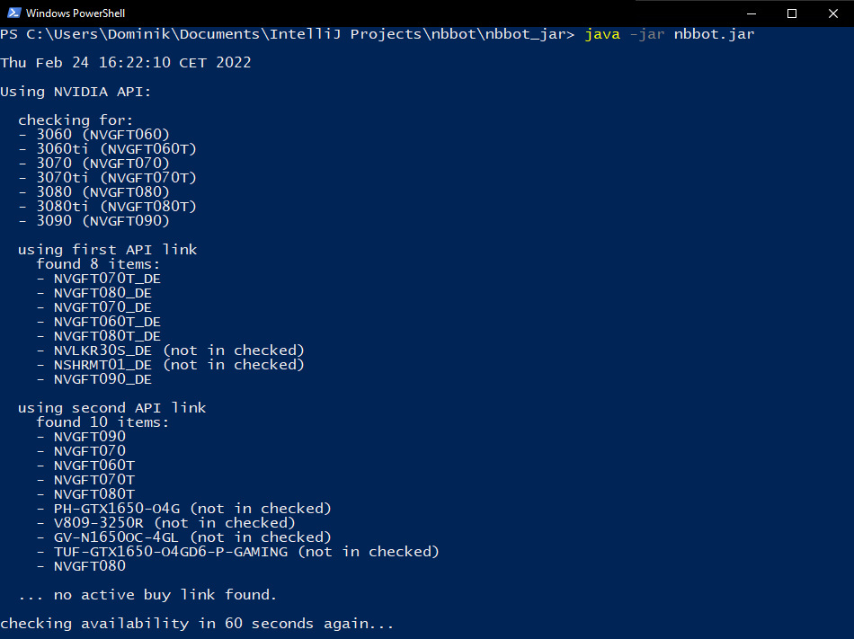

### _nbbot_ ist ein Bot, um RTX Grafikkarten bei _notebooksbilliger.de_ zum UVP (Normalpreis) zu ergattern.

_notebooksbilliger.de_ hat die exklusive Partnerschaft, die NVIDIA 3000 Reihe zum UVP anbieten zu können. 
Leider sind diese sehr schnell ausverkauft und kommen nur unregelmäßig wieder in die Regale.

Da die aktuellen Preise maßlos überzogen und unmoralisch sind, habe ich diese kleine App geschrieben, die jedem die Möglichkeit geben soll, eine Grafikkarte zu ergattern.
Die App prüft im Minutentakt die Webseite von _notebooksbilliger.de_ nach Grafikkarten zum UVP. Sollte eine Karte erhältich sein, so wird im Standardbrowser die Seite geöffnet, damit man die Grafikkarte mit nur wenigen klicks im Warenkorb hat.
Es lohnt sich deshalb, die App nebenher laufen zu lassen.

__Quickstart:__
1. Lade die [_nbbot.jar_](nbbot_jar/nbbot.jar) Datei im Ordner _nbbot_jar_ herunter und speichere sie an gewünschtem Ort.
1. Öffne die Befehlszeile (cmd) im selben Ordner der _nbbot.jar_. Alternativ kann mit einem Doppelklick auf _nbbot.jar_ die Anwendung im Hintergrund gestartet werden.
    - Unter Windows: Shift+Rechtsklick -> "PowerShell-Fenster hier öffnen.
    
1. Gib den Befehl `java -jar nbbot.jar` ein um das Programm zu starten. Es ertönt ein akustisches Signal. 
    - Spezielle Karten können mit `-3060` `-3070` `-3070ti` `-3080` `-3080ti` `-3090` beobachtet werden.
        - z.B `java -jar nbbot.jar -3060`  
    - Es ist ein Standard Schwellwert von 20 EUR eingestellt. Über `-threshold=WERT` kann ein beliebiger Wert eingestellt werden.
        - z.B `java -jar nbbot.jar -3060 -3070ti -threshold=50` für 50 EUR über UVP  
1. Fertig! Im Fenster werden nun alle Informationen angezeigt.
      
1. Sobald eine Karte zum UVP gefunden wurde, wird automatisch die Seite der Karte geöffnet mit Login Popup.
      
    
1. Die UVP pro Karte sind folgende:  
     3060,    3070,    3070ti,    3080,    3080ti,    3090  
      330€,     520€,       620€,     720€,      1200€,    1550€ 
      
1. TIPPs:
    Einen Account im vorhinein anlegen und Kredikarteninformationen hinterlegen! Grafikkarten sind nur per Kreditkarte oder Amazon Pay erhältlich.
    
__Installation:__
1. Lade die [_nbbot.jar_](_nbbot_jar/nbbot.jar) Datei herunter und speichere sie an gewünschtem Ort.
1. Öffne die Befehlszeile (cmd) im selben Ordner der _nbbot.jar_
    - Unter Windows: Shift+Rechtsklick -> "PowerShell-Fenster hier öffnen.
1. Gibt den Befehl `java -jar nbbot.jar` ein und drücke Enter.
1. Fertig! Im Fenster werden nun alle Informationen angezeigt.

__Erweiterte Benutzung:__ 
- Die App sucht im Standardmodus alle Grafikkarten (3060, 3070, 3070ti, 3080, 3080ti, 3090).  
  Über die Startparameter kann speziell nach einer Reihe gesucht werden.  
Will beispielsweise nur nach 3060 und 3070ti gesucht werden, so starte die App mit folgendem Befehl:  
`java -jar nbbot.jar -3060 -3070ti`
- Im Standardmodus wird zusätzlich bei einer gefundenen Karte die Webseite inkl. Login-Popup angezeigt, um sich schneller einloggen zu können.  
  Ist dies nicht gewollt, so ergänze den Befehl mit `-nologin`

__DISCLAIMER:__
Das Projekt steht weder mit _NVIDIA_, noch mit _notebooksbilliger.de_ in Verbindung! Jegliche Benutzung der App ist auf eigenem Risiko abzuwägen. Es wird keine Haftung übernommen! 
